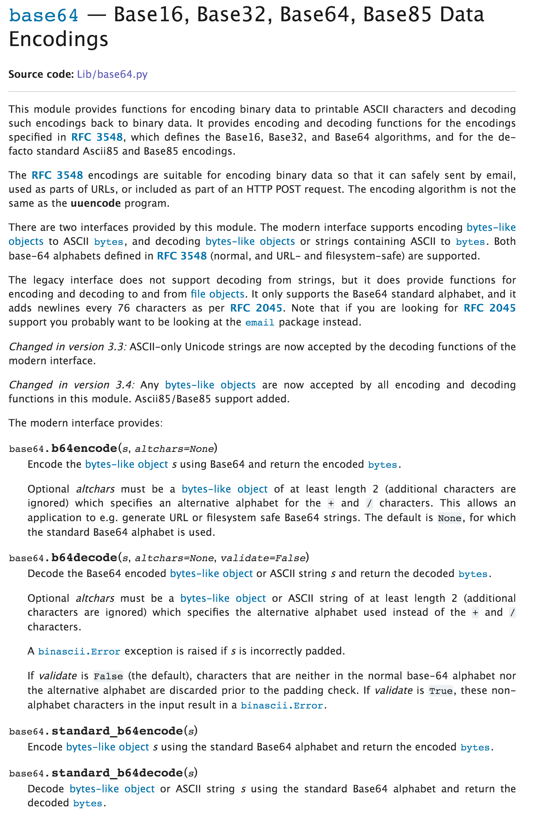
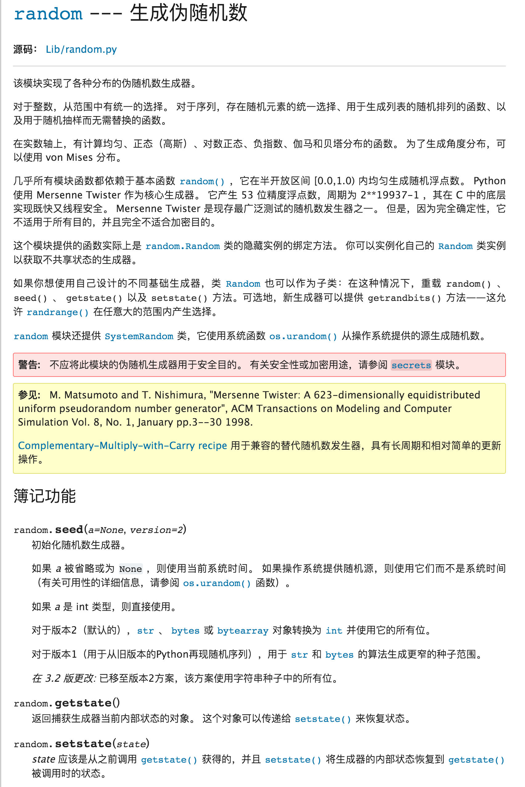
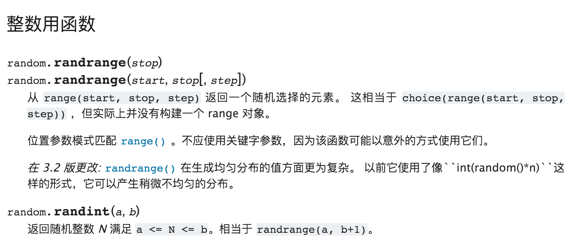
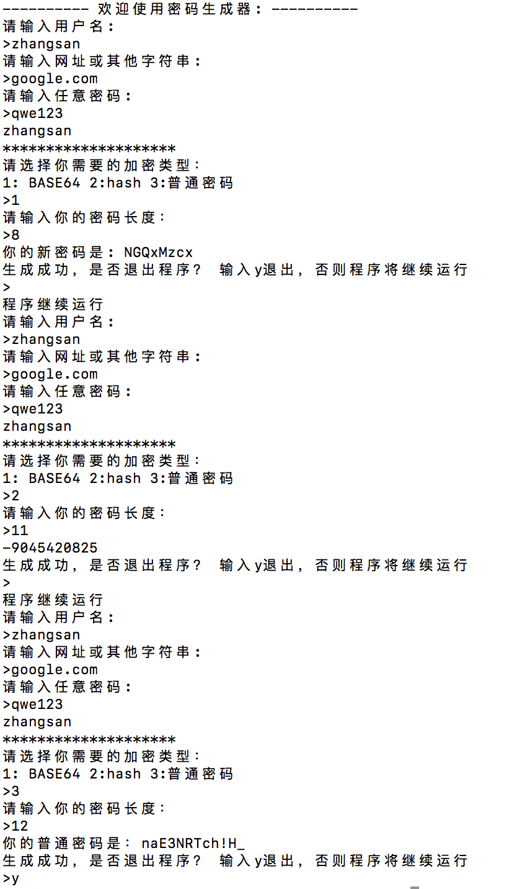

# python结业项目

## 需求

要求用户输入三次信息，第一次输入为用户名（任意字符），第二次为网址或任意字符，第三次则输入一个加密口令，也可以是任意字符，第四个是菜单，要求用户密码看起来貌似为某一类型的加密方式  

选项1:Base64 选项2:hash 选项3:普通密码  

普通密码格式限制首字符大写，含有英文和数字，以及字符，并且分布均无特性。  

#### 新增需求

试着为普通密码加入更多的限制条件，如，必须有一个大写的首字母，必须含有小写字母，必须含有数字，和常见符号（常见可输入的符号，但不允许有 " ' （）/\）  

## 思路

提示：所有函数在进行选项处理之前都已经使用md5的初次加密，并且重新组合。  

Tip: All functions have been encrypted with md5 for the first time before option processing and recombined  

### 选项1:Base64

Python3在代码库中提供了base64的解决办法，需要注意的是python2和python3有少许的区别  

python2中只支持标准的Base64字母表，且不支持解码操作。



可以直接使用Python官方提供的Base64函数将字符串进行加密，经过处理之后的字符串使用字符串切片截取成需要的长度

Base64编码是一种“防君子不防小人”的编码方式。广泛应用于MIME协议，作为电子邮件的传输编码，生成的编码可逆，后一两位可能有“=”，生成的编码都是ascii字符。
优点：速度快，ascii字符，肉眼不可理解
缺点：编码比较长，非常容易被破解，仅适用于加密非关键信息的场合

### 选项2:Hash


Python自带hashlib库，将处理之后的字符串放进去返回出结果后使用字符串切片即可。

### 选项3:普通密码

普通密码格式限制首字符大写，含有英文和数字，以及字符，并且分布均无特性。

首先感谢我师父给予的提示（种子随机数）伪随机数





首先确定结果值的首字母为一个大写字母（写程序之前可能记错了～模糊中记得首字母要求大写） 

将整个字符串丢进seed中，设定为种子数（）字符串对象会被系统转换为int并使用它的所有位，设置取值范围为65，90 （全部都是大写字母）     

创建一个循环将字符串中的所有值依次设置为种子数，并设定取值范围（33，126）包含了当前需要的所有字符  

将最终得到的字符串进行切片即可得到最终的密码  

### 新增需求：

不允许出现某些特殊字符如：" ' （）/\  

根据代码实现不同在合适的位置进行判断是否有特殊字符，如果包含有特殊字符则使用re.sub函数进行处理，该函数会返回处理之后的字符串，得到处理之后的字符串进行切片即可

## 代码实现

```
#!/usr/bin/env python3
#-*- coding:utf-8 -*-
import hashlib
import base64
import random
import string
import sys
import re

def basecode () :
	# 使用base64进行加密
	encodestr = base64.b64encode(md5code.encode(encoding='utf-8'))
	print ("你的新密码是:",encodestr[0:longer].decode('ASCII'))

	# 使用base64进行解密
	#decodestr = base64.b64decode(encodestr)
	#print (decodestr.decode())

def pwd1():
	
	# 创建一个空字符串，用于保存当前生成的随机数
	sum1 = ''
	# 设置种子随机数
	#random.seed(md5code)
	# 设置取值范围,将首字母锁定为大写字母
	# Set the value range and lock the first letter to uppercase
	#abc = random.randint(65,90)
	sum1 += chr(abc)

	# 将字符串中的字符依次取出，并设置为种子随机数
	# Take the characters in the string one by one and set them as seed random numbers
	for i in md5code :
		random.seed(i)
		num = random.randint(33,126)
		sum1 += chr(num)

	# 为了防止在取值过程中取到限制字符，所以需要在进行下标位获取之前将字符串格式化
	'''
	In order to prevent the limit character from being fetched during the value it is 
	necessary to format the serial before acquiring the subscript bit
	'''
	sum2 = re.sub(r'[()\'\"()\\\/]','',sum1)

	# 定义一个变量存储需要获取的下标位
	# Define a variable to store the subscript bit to be obtained 
	number = len(sum2) // longer

	# 定义一个临时变量，将字符串转为列表，方便取值
	# Define a temporary variable to convert the string to a list for easy value
	temp = list(sum2)

	a = 0
	sum3 = ''
	# 此处循环应该小于该字符串长度，否则会造成下标溢出
	# Here the loop should be less than the length of the string otherwise it will cause subscript overflow
	while a < longer :
		# 将每次得到的值存入sum2列表中，然后使用del将得到开始位置至得到位置的数据全部删除，防止取值重复
		'''
		Store the value obtained each time in the sum2 list and then use del to delete all the data from the starting
		position to the obtained position to prevent duplicate values
		'''
		# 注意，之前计算的数值下标位从1开始，取值时从0开始，一定要注意！！！
		'''
		Note that the subscript bit of the numerical value calculated before stats from 1 and the value start from 
		0 be sure to pay attention!!!
		'''
		sum3 += temp[number-1]
		del temp[0:number-1]
		# 每次自增1，保证循环体正常运行
		a += 1

	print (f'你的普通密码是：{sum3[0:longer]}')

def pwd () :
	'''
	鉴于师父提到使用折叠法，故此新设一版以供使用
	实现思路：
		只需要将先使用除法获得到的值转换为ascii码，进行相加后，再进行转换，以下代码为实现过程。
	'''

	# 定义一个列表用于存储处理后的值
	sum1 = []
	for i in md5code :
		# 设定种子随机数
		# Set seed random number
		random.seed(i)
		# 限制取值范围
		# Limit value range
		num = random.randint(33,126)
		# 将每次取得的值使用append函数保存到列表中
		# Save the value obtained each time to the list using the append function
		sum1.append(num)

	# 创建一个新变量保存需要折叠的次数，将当前字符串的长度整除用户输入的长度，得到需要取值的次数
	'''
	Create a new variable to save the number of times you need to fold divide the length of the current
	string by the length entered by the user and get the number of times you need to get the value
	'''
	number = len(sum1) // longer

	# 定义一个变量用于控制当前循环,当前值设定为1，防止内部循环在整数循环时出现下标越界错误
	'''
	Define a variable to control the current loop the current value is set to 1 to prevent subscript
	out-of-bounds errors in the internal loop in the integer loop 
	'''
	a = 1

	# 创建一个列表用于保存处理之后的数据
	# Create a lisr to save the processed data
	sum4 = []

	# 设定当前循环次数
	while a < longer :
		# 创建一个变量用于保存内部循环体内获取到的数据
		# Create a variable to save the data obtained in the internal loop 
		x = 0

		# 设定内部循环的初始值
		# Set the initial value of the internal loop 
		i = 0

		while i < number :
			# 将每次获得的值添加到变量中
			# Add the value obtained each time to the variable
			x += sum1[i]

			# 删除列表中已经获取的值
			# Delete the value already obtained in the list
			del sum1[i]
			# 变量自增1，完成循环体
			i += 1
		
		# 将获取到的值设置为种子随机数
		# Set the obtained value as a seed random number
		random.seed(x)

		# 设置取值范围
		# Set the value range
		sum3 = random.randint(33,126)

		# 将值添加到列表中
		# Add value to list
		sum4.append(chr(sum3))

		# 将列表转换为字符串，并且将字符串进行格式化，去除特殊字符后赋值给一个新变量
		# Convert the list to a string and format the string remove the special characters and assign to a new variable
		temp = ''.join(sum4)
		sum5 =  re.sub(r'[()\'\"()\\\/]','',temp)
		a += 1

	# 以下代码为补充代码，当前字符串长度不够时会进行长度补充，同时进行判断是否含有特殊字符，并做相应处理
	'''
	The following code is a supplementary code When the current string length is not enough the length will be 
	supplemented At rge same time it will judge whether it contains special characters and do the corresponding processing
	'''
	while len(sum5) != longer :
		random.seed(sum5)
		x = random.randint(33,126)
		y = chr(x)
		sum1 =  re.sub(r'[()\'\"()\\\/]','',y)
		sum5 += sum1

	print(f'你的普通密码是：{sum5}')


# 输入某一个字符退出当前程序
# Enter a certain character to exit the current program
def finished():
	y = input ("生成成功，是否退出程序？ 输入y退出，否则程序将继续运行\n>")
	if y == 'y' or y =="Y" or y =="YES" or y == 'yes' :
		sys.exit()
	else :
		print('程序继续运行')


# 用户名预处理，并返回处理后的字符串
# User name preprocessing and return the processed string 
def firstuser(username) :
	user1 = ''
	print (username)
	for i in username :
		random.seed(i)
		username = random.randint(33,126)
		user1 += chr(username)
	return user1

# 网址或任意字符串预处理，并返回处理后的字符串
# URL or arbitrary string preprocessing and return the processed string 
def firstother(other) :
	other1 = ''
	for i in other :
		random.seed(i)
		ot = random.randint(33,126)
		other1 += chr(ot)
	return other1

# 任意字符串预处理，并返回处理后的字符串
# Preprocess arbitrary strings and return the processed strings
def firstpass (password) :
	password1 = ''
	for i in password :
		random.seed(i)
		ps = random.randint(33,126)
		password1 += chr(ps)
	return password1


# 代码开始执行
# Start here
if __name__ =='__main__' :
	
	print ('-'*10,"欢迎使用密码生成器:",'-'*10)

	while True :

		username = input("请输入用户名:\n>")

		other = input("请输入网址或其他字符串:\n>")

		apwd = input("请输入任意密码:\n>")

		# 将用户输入的信息全部进行分别处理后，拿到返回值进行合并，之后进行下一次的操作
		'''
		After all the information input by the user is processed separately the return value is obtained and merged
		and then the next operation is performed
		'''
		fp = firstuser(username)
		fp1 = firstother(other)
		fp2 = firstpass(apwd)

		# 处理长度超过20的字符时，使用f-string方式可以使编译器更快的运行，效率更高
		# When processing characters longer than20 using f-string can make the compiler run faster and more efficiently
		all = f'{fp}{fp1}{fp2}'

		# 密码预处理
		# Password preprocessing
		md5 = hashlib.md5()
		# 测试一次加密后是否正确
		md5.update(all.encode(encoding='utf-8'))
		md5code = md5.hexdigest()
		#print (f"加密后的字符串为：{md5code}")

		print ('*' * 20)
		choose =input ("请选择你需要的加密类型：\n1: BASE64 2:hash 3:普通密码\n>")

		# 强制用户输入一个大于0的正整数
		# Force the user to enter a pasitive integer greater than 0 
		trueinput = False
		# 只有用户输入正确的数值时，才会退出循环。
		# Only when the user enters the correct value will the loop be exited 
		while not trueinput :
			try :
				longer = int(input ("请输入你的密码长度：\n>"))
				if longer > 0 :
					trueinput = True 
				else :
					print('密码长度输入不正确，请重新输入')
			except ValueError :
				print ('输入不正确，请重试（长度为正整数）')

		if choose == '1' :
			basecode()
			finished()

		elif choose == '2' :
			newhash = str(hash(md5code))
			print (newhash[0:longer])
			finished()

		elif choose == '3' :
			pwd()
			#pwd1()
			finished()
		else :
			print ("加密类型输入不正确，请重新输入")

```

结果：



### 总结

~~**终于写完了！！！**~~

在完成基本功能的情况下增加了~~程序的健壮性~~，欢迎体验！。

~~有一些额外的小bug，如果你发现了记得通知我。暂时我还没想到怎么解决。~~


### 参考读物

python官网

https://www.python.org/

字符串拼接的类型详解

https://zhuanlan.zhihu.com/p/48261652

混杂密码

https://blog.gtwang.org/linux/generate-linux-shadow-encrypted-password/