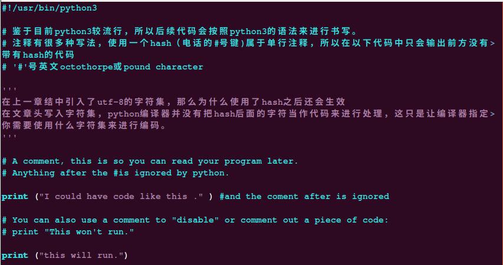
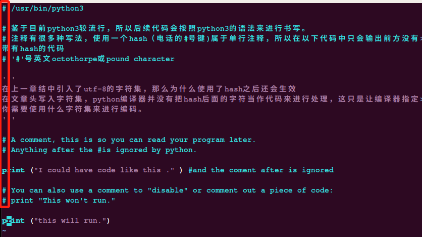

## 基本概念

在我们看代码的时候,会遇到很多看不懂的代码,特别是做项目的时候,代码的注释以及命名习惯的重要性就会体现出来.

When we look at the code we will encounter a lot of unreadable code, especially when working on projects , the importance of code comments and naming conventions will be reflected

简单来说,注释是什么,注释就是告诉陌生人,你这一段代码是用来做什么的.

In simple terms what a comment is a comment tells a stranger what your code is used for .

使用注释,让你的代码更加的容易被他人理解.

Use comments to make your code easier to understand by others.

## 实际练习

本章主要展示出注释的作用

This chapter mainly shows the role of annotations

在操作中只需要将你需要注释的内容前加入#号即可.

In the operation just add the # before the content you need to comment .

\#号后的内容被称作为注释.

The content after the \# is called a comment.

注意 #号只对当前行有用

Note that the # sign is only useful for the current line.

实际效果：

## 分析与总结

可以看到在整个代码块中只有两行输出没有添加注释,其他所有代码前都添加了注释.

You can see that there are only two lines of output without comments in the entire code block and comments are added before all other code.

在上一章中提到了ASCII编码的问题. 这里再次强调一下. #后的代码只是注释.

The problem of ASCII encoding was mentioned in the previous chapter Here again the code after # is just a comment

但是为什么在设定字符集之后就可以输出中文了呢?因为使用#号注释后的代码时不会被当作代码来运行的.你设定的字符集只是告诉编译器,你会以什么样的编码形式来进行编码.

But why can you output Chinese after setting the character set? Because the code commented with # sign will not be run as code The character set you set just tells the compiler what you will do Encoding form.

## 附加练习

### 练习1 弄清楚#号的作用,而且记住它的名字.(中文叫做井(#)号) 英文叫做octothorpe或者pound character

Exercise 1 Find out the role of the # sign and remember its name. (Chinese name is 井（#）号) English name is octothorpe or pound character

#### 简述答案

注释就是让当前行或多行代码,在进行编译时不进行编译,注释后的代码也不会被执行.

Commenting is to make the current line or multiple lines of code not compile when compiling and the commented code will not be executed.

### 脚本

结果

所有被注释的代码都没有被执行.

None of the commented code was executed

## 附加笔记

使用注释可以让你的代码拥有更强的可读性.养成良好的习惯.

Using comments can make your code more readable Make Good habits

\#注释只能注释井(#)号后的当前行内容

\# Comment can only comment the current line content after the well (#) sign

多行注释可以使用三对单引号’’’注释块’’’

Multi-line comments can use three pairs of single quotes "comment block"

也可以使用三对双引号来进行注释”””注释块”””

You can also use three pairs of double quotes to comment "Comment block"