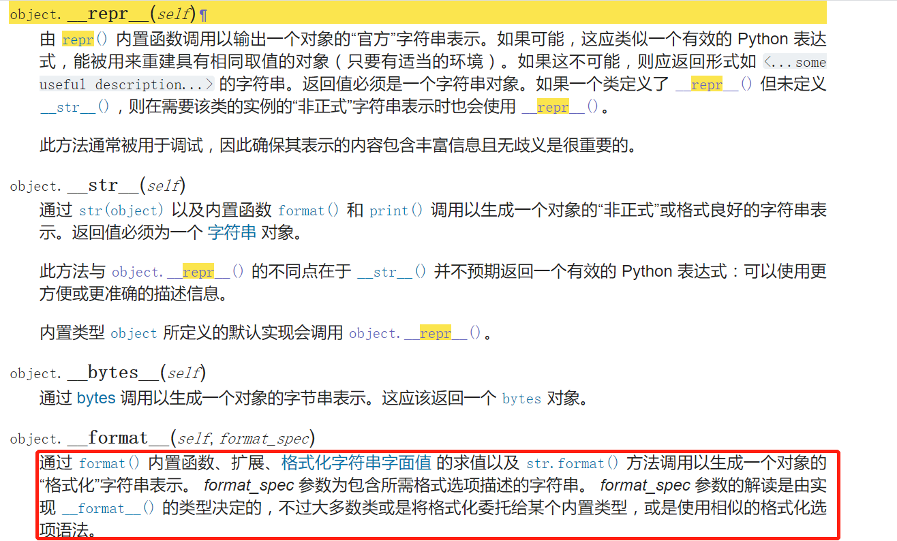
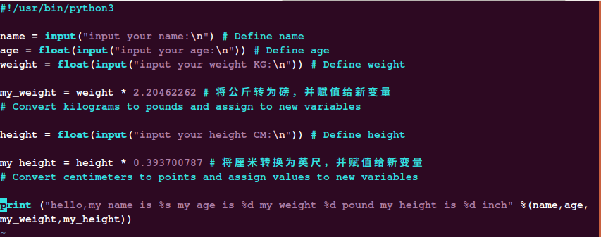

# Python基础05(ex5.py)

## 基本概念

格式化字符串

Format String.

Python中的字符串字面量由单引号或双引号括起

String literals in Python are enclosed in single or double quotes

“hello” 等同于’hello’

“hello” is equal to ‘hello’

## 实际练习

```
#!/usr/bin/env python3
#-*- coding:utf-8 -*-


#本章节熟悉赋值使用,以及命名
#最好的变量命名方式需要达到见名知意
name = 'Zed A. shaw' # 姓名 Define name
age = 35  # 年龄 Define age
height = 74 # 体重 Define height
weight = 180 # 身高 Define weight
eyes = 'bule' # 眼睛颜色 Define eyes color
teeth = 'White' # 牙齿颜色 Define teech
hair = 'brown' # 头发颜色 Define hair

print ("let's talk about %s."%name)
print ("He's %d inches tall."%height)
print ("He's %d pounds heavy."%weight)
print ("Actually that's not too heavy.")
print ("He's got %s eyes and %s hair." %(eyes,hair))
print ("His teeth are usually %s depending on the coffee." %teeth)

# this line is tricky,tricky,try to get it exactly right
print ("if I add %d,%d,and %d I get %d." %(age,height,weight,age + height + weight))
```


实际效果:


## 分析与总结

格式化字符串时,Python使用一个字符串作为模板.模板中有格式符,这些格式符为真实的值预留位置.

When formatting a string Python uses a string as a template. There are format characters in the template. These format characters reserve a place for the real value

Python用一个tuple将多个值传递给模板,每个值对应一个格式符

Python uses a tuple to pass multiple values to the template each value corresponds to a format character

格式符为真实值预留位置,并控制显示的格式,格式符可以包含有一个类型吗,用以控制显示的类型:

The format character reserves a place for the real value and controls the format of the display Can the format character contain a type to control the type of display:

%s  字符串 (采用str()的显示)

%r  字符串 (采用repr()的显示)

%c  单个字符

%b  二进制整数

%d  十进制整数

%i  十进制整数

%o  八进制整数

%x  十六进制整数

%e  指数 (基底写为e)

%E  指数 (基底写为E)

%f  浮点数

%F  浮点数，与上相同

%g  指数(e)或浮点数 (根据显示长度)

%G  指数(E)或浮点数 (根据显示长度)

%%  字符"%"


Python中内置的%操作符可用于格式化字符串操作,控制字符串的呈现格式.Python中还有其他格式化字符串的方式,但使用%操作符是最方便的.

The% operator built into Python can be used to format string operations and control the formatting of strings .There are other ways to format strings in Python but using the% operator is the most convenient

## 附加练习

### 练习1. 修改所有的变量名字，把它们前面的``my_``去掉。确认将每一个地方的都改掉，不只是你使用`` =``赋值过的地方。

#### 简述答案:

变量的命名与变量本身的值没有任何联系.只要符合变量的命名规则即可.

The naming of a variable has nothing to do with the value of the variable itself, as long as it conforms to the naming rules of the variable

### 脚本

```
#!/usr/bin/env python3
#-*- coding:utf-8 -*-


#本章节熟悉赋值使用,以及命名
#最好的变量命名方式需要达到见名知意
name = 'Zed A. shaw' # 姓名 Define name
age = 35  # 年龄 Define age
height = 74 # 体重 Define height
weight = 180 # 身高 Define weight
eyes = 'bule' # 眼睛颜色 Define eyes color
teeth = 'White' # 牙齿颜色 Define teech
hair = 'brown' # 头发颜色 Define hair

print ("let's talk about %s."%name)
print ("He's %d inches tall."%height)
print ("He's %d pounds heavy."%weight)
print ("Actually that's not too heavy.")
print ("He's got %s eyes and %s hair." %(eyes,hair))
print ("His teeth are usually %s depending on the coffee." %teeth)

# this line is tricky,tricky,try to get it exactly right
print ("if I add %d,%d,and %d I get %d." %(age,height,weight,age + height + weight))

print ("我是修改后的代码")

```


结果:


### 练习2. 试着使用更多的格式化字符。例如 %r 就是是非常有用的一个，它的含义是“不管什么都打印出来”。

#### 简述答案:



repr()函数会将需要转换的字符串进行原样输出

The rer() function will output the string to be converted as is

### 脚本


结果:


### 练习3 试着使用变量将厘米和千克转换成英寸和磅。不要直接键入答案。使用 Python 的计算功能来完

#### 简述答案:

将用户输出的内容使用变量进行保存,将变量进行计算后赋值给新变量,最后进行输出即可

Save the content output by the user with a variable calculate the variable and assign it to a new variable and finally output it

### 脚本



结果:


## 附加笔记

在进行格式化操作时,需要记住每种字符对应的操作符号

When formatting you need to remember the operation symbol corresponding to each character

常见的操作符号

Common operation symbols

%s 字符串变量

%s string Variable

%d 数字类型变量

%d Numeric Variable

%r 原样输出(多用于debug)

%r output as-is (mostly for debugging)