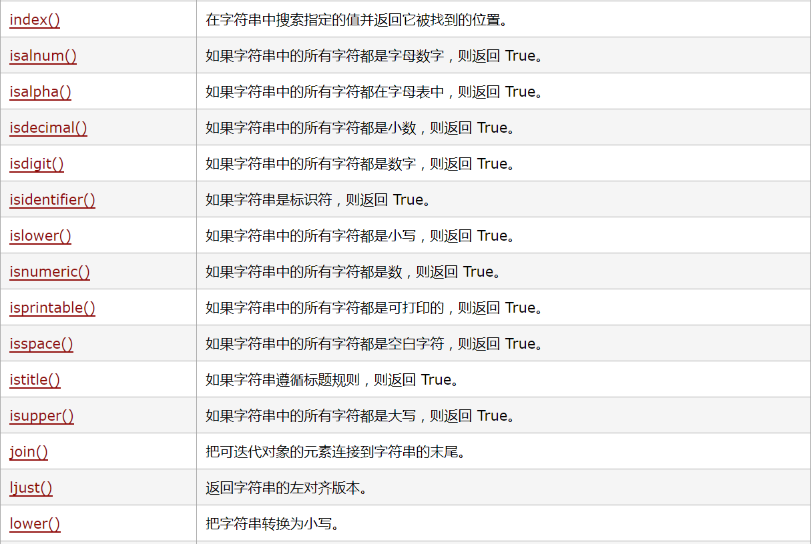
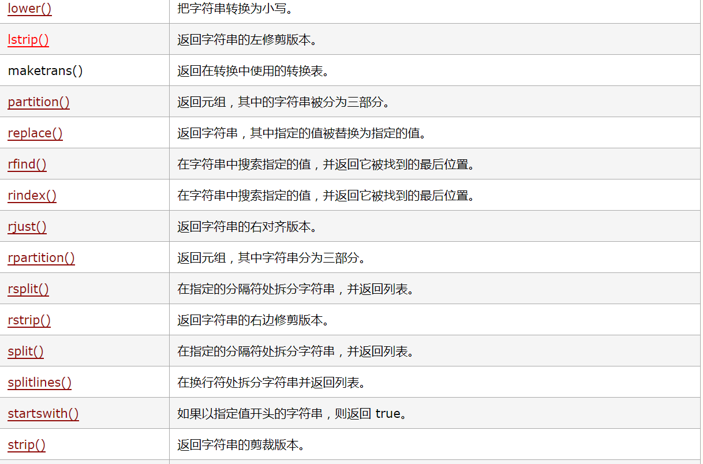
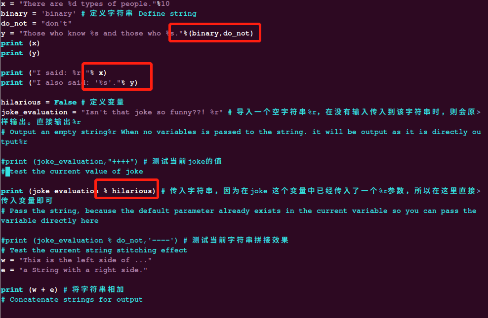
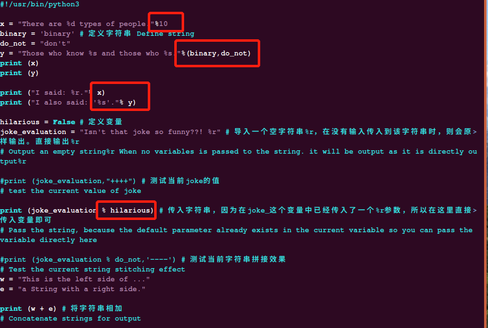

# Python基础06(ex6.py)

## 基本概念

字符串在python中定义时使用单引号或者双引号进行包裹

在进行打印输出时可以使用格式化字符串%s进行输出.

格式为print(“%s”%a)

在进行多个字符串输出时,需要将值依次传递给%s,每一个%s对应一个变量

格式为print(“我是第一个值%s,我是第二个值%s”%(a,b))

Strings arewrapped in single or double quotes when defined in python

You can use the format string%s for print output

The format is print(“%s”%a)

When outputiing multiple strings,you need to pass the values to%sin turn each%s correspondsto a variable

The format is print(“I an the first value%s I am the secondvalue%s”%(a,b))

## 实际练习

本章练习拼接字符串,打印和连接字符串

This chapter exercises concatenating strings printing and concatenating strings


代码:

```
#!/usr/bin/env python3
#-*- coding:utf-8 -*-


x = "There are %d types of people."%10
binary = 'binary' # 定义字符串 Define string
do_not = "don't"
y = "Those who know %s and those who %s."%(binary,do_not)
print (x) 
print (y)

print ("I said: %r."% x) 
print ("I also said: '%s'."% y)

hilarious = False # 定义变量
joke_evaluation = "Isn't that joke so funny??! %r" # 导入一个空字符串%r，在没有输入传入到该字符串时，则会原样输出。直接输出%r
# Output an empty string%r When no variables is passed to the string. it will be output as it is directly output%r

#print (joke_evaluation,"++++") # 测试当前joke的值
# test the current value of joke

print (joke_evaluation % hilarious) # 传入字符串，因为在joke_这个变量中已经传入了一个%r参数，所以在这里直接传入变量即可
# Pass the string, because the default parameter already exists in the current variable so you can pass the variable directly here

#print (joke_evaluation % do_not,'----') # 测试当前字符串拼接效果
# Test the current string stitching effect
w = "This is the left side of ..."
e = "a String with a right side."

print (w + e) # 将字符串相加
# Concatenate strings for output

```


实际效果:


## 分析与总结

在定义字符串时,可以通过三个双引号或单引号将字符串赋值给一个变量.

When defining a string you can assign the string to a variable with three double or single quotes

Python中的字符串是表示unicode字符的字节数组

String in Python is a byte array representing Unicode characters

但是Python没有字符数据类型,单个字符就是长度为1的字符串

But Python has no character data type a single character is a string of length 1.

方括号可用于访问字符串的元素.

Square brackets can be used to access elements of a string

注意:字符串的第一个下标为0

Note:the first subscript of the string is 0

B = ‘hello,world’

print(a[1])


字符串裁切,裁切可以返回一切范围内的字符.

String trimming which returns characters in all ranges

指定开始索引和结束索引,以冒号分隔.

Specify the start index and end index,separated by colons

B = “hello,world”

Print(b[2:5])

字符串负索引

String negative index

使用负索引从字符串末尾开始切片:

Use a negative index to slice from the end of the String

获取从-3位置到-1

Get position from -3 to -1


获取字符串长度使用len关键字

Get string length using len keyword


Python中字符串有一组可用于字符串的内置方法,使用strip()可以去除字符串中多余的空白字符.

String in Python have a set of built-in methods that can be used with strings,Uses strip() to remove extra whitespace characters from a string

注意:只能删除开头或结尾的空白字符

Note: Only leading or trailing whitespace characters can be removed

A = ‘  a,b,c,d ,e,f ’

Print(a.strip())


lower()返回小写的字符串:

lower() returns a lowercase string:

a = “HELLO,WORLD”

print(a.lower())


upper()返回大写的字符串.

upper() returns an uppercase string:

a = “hello,world”

print(a.upper())


replace() 用另一段字符串来替换字符串

replace() replaces a string with another string

a = ‘hello,world’

print(a.replace(‘world’,’abcdefg’))


split() 找到其中的分隔符并将字符串拆分为子字符串(需要指定分隔符来进行拆分)
 split() finds the delimiter in it and splits the string into substrings(requires the delimiter to be split)

a = ‘hello,world’

print(a.split(“l”))


以下为python中的字符串方法

Following is the string method in python







## 附加练习

### 练习1找到所有的”字符串包含字符串”的位置，总共有四个位置。

#### 简述答案:

在代码中找到带有%的传输位置.

Find the transmission location with% in the code 

### 脚本



### 练习2你确定只有四个位置吗？你怎么知道的？没准我在骗你呢。

#### 简述答案:

在传输时候,使用%号并不一定需要传输一个变量到输出字符串中,也可以传输一个具体的值到字符串中

When transmitting using the% sign does not necessarily require you to transfer a variable to the output string but you can also transfer a specific value to the string

### 脚本



### 练习3 解释一下为什么 w 和 e 用 + 连起来就可以生成一个更长的字符串。

#### 简述答案

在串联或组合两个字符串时,可以使用加号(+)运算符.

You can use the plus(+) operator when concatenating or combining two strings

### 脚本


结果:


## 附加笔记

在进行字符串拼接时,确保拼接的字符串类型相同

When string concatenation make sure that the concatenated string types are the same


当你使用数字类型和字符串类型进行拼接时则会出现以下错误

When you use number type and string type for splicing you get the following error


Python中%的用法大致分为两种

The usage of% in Python is roughly divided into two kinds

一种是进行模运算,相当于operator.mod方法,用来计算的余数

One is to perform modulo operation which is equivalent to the operator mod method which is used to calculate the remainder


另外一种就是使用%来进行格式化输出.

The other is to use% for formatted output