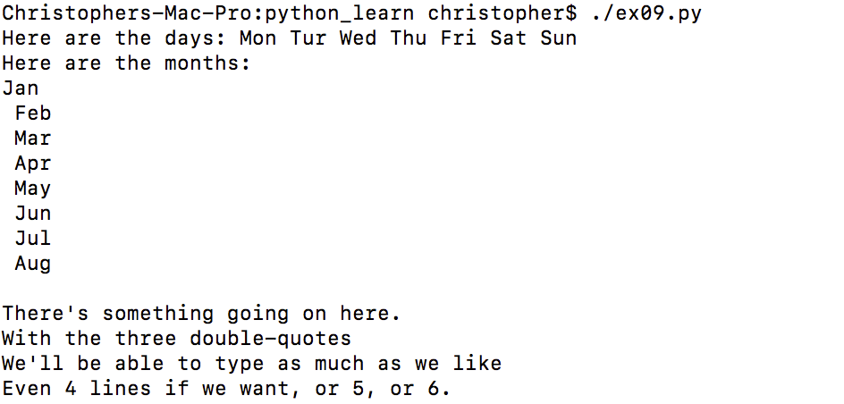

# Python基础09(ex09.py)

## 基本概念

转义符操作以及字符串操作和变量的打印

Escape character operations and printing of string operations and variables

使用三个单引号或双引号进行多行字符串拼接

Multi-line concatenation cascading with three single or double quotes

## 实际练习

使用转义符来进行字符串中的换行操作.

Use escape characters for newline operations in strings

```
#!/usr/bin/env python3
#-*- coding:utf-8 -*-

# Here's some new strange stuff, remember type it exactly.
# 输出，各种输出。
days = "Mon Tur Wed Thu Fri Sat Sun"
# 在输出后加\n的目的是为了换行。
# The purpose of adding \n to the string is to perform a newline operation after the current character output is complted
months = "\nJan\n Feb\n Mar\n Apr\n May\n Jun\n Jul\n Aug"

print ("Here are the days:",days)
print ("Here are the months:",months)

print ("""
There's something going on here.
With the three double-quotes
We'll be able to type as much as we like
Even 4 lines if we want, or 5, or 6.
""")

```


实际效果:



## 分析与总结

在字符串打印中可以使用三个引号来进行多行输出.

You can use three quotes for multi-line output in string printing

需要在字符中使用特殊字符时,可以使用反斜杠(\)来进行转义

When you need to use special characters in a character you can use the backslash(\) to escape

Python 中提供了以下转义符:

The following escape characters are provided in Python :

\(在行尾时)	续行符 Continuation character

\\	反斜杠符号 Backslash symbol

\'	单引号 apostrophe

\"	双引号 Double quotes

\a	响铃 bell

\b	退格(Backspace)

\n	换行 Linefeed 

\v	纵向制表符 vertical tab

\t	横向制表符 Horizontal tab

\r	回车 Enter key

\f	换页 form feed

\oyy	八进制数，yy代表的字符，例如：\o12代表换行

\xyy	十六进制数，yy代表的字符，例如：\x0a代表换行

\other	其它的字符以普通格式输出

## 附加练习

### 练习1

无

#### 简述答案

无

### 脚本

无

## 附加笔记

常用的转义字符\\ 打印一个\

Common escape characters \\ print a \

在当前位置进行换行操作\r

Switch to the next line at the current position

输出单引号\’

Output single quote\’

输出双引号\”

Output single quote\”