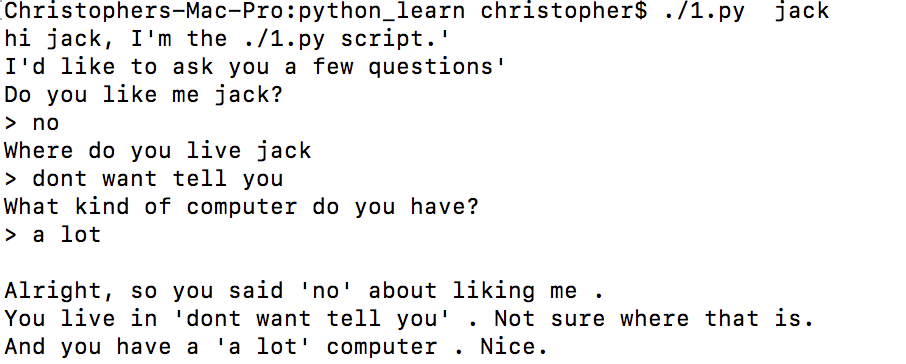
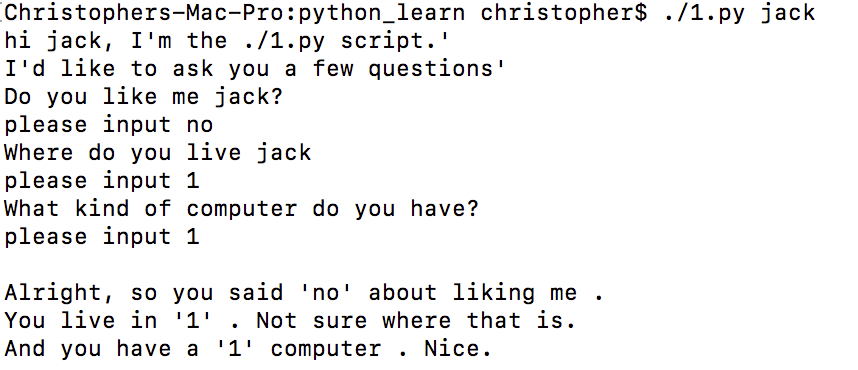

# Python基础14(ex14.py)

## 基本概念

使用input()函数来进行一些简单的操作。

Use the input() function for some simple operations

重复使用一个变量来进行操作。

Reuse a variable to operate

复习之前的学习内容，如三个引号(“””) 以及占位符(%)的使用

Review previous learning content such as the use of three quotation marks(‘’’) and placeholders (%)

## 实际练习

```
#!/usr/bin/env python3
#-*- coding:utf-8 -*-

from sys import argv 
# 从sys模块中导入argv

script , user_name = argv 
# 创建一个只有2个元素的列表。
# Create a list with only 2 elements

prompt = '> ' 
# 定义一个变量。
# Define a variable

print ("hi %s, I'm the %s script.'" %(user_name,script))

print ("I'd like to ask you a few questions'")

print ("Do you like me %s?" %user_name)
likes = input(prompt)

print ("Where do you live %s" %user_name)
lives = input(prompt)

print("What kind of computer do you have?")
computer = input(prompt)

# 格式化字符串将变量传入并输出
# format string to pass in and output variables 
print ("""
Alright, so you said %r about liking me .
You live in %r . Not sure where that is.
And you have a %r computer . Nice.
"""%(likes,lives,computer)
)
```

实际效果：



## 分析与总结

参数的传递需要在调用脚本时同步传入，否则会报错。

Parameter passing needs to be passed in synchronously when the script is called otherwise an error will be reported 

使用一个变量来进行保存重复或多次需要用到的代码,增加代码的复用性

Use a variable to save code that is used repeatedly or multiple times to increase code reuse

## 附加练习

### 练习1将 prompt 变量改成完全不同的内容再运行一遍。

#### 简述答案：

修改当前的提示变量，则当前代码中的提示都会随着变量值的更改而改变。

Modify the current prompt variable the prompt in the current code will change as the value of the variable changes 

### 脚本

```
#!/usr/bin/python3

from sys import argv # 从sys模块中导入argv

script , user_name = argv 
# 创建一个只有2个元素的列表。
# Create a list with only 2 elements

prompt = 'please input ' 
# 定义一个变量。
# Define a variable

print ("hi %s, I'm the %s script.'" %(user_name,script))

print ("I'd like to ask you a few questions'")

print ("Do you like me %s?" %user_name)
likes = input(prompt)

print ("Where do you live %s" %user_name)
lives = input(prompt)

print("What kind of computer do you have?")
computer = input(prompt)

# 格式化字符串将变量传入并输出
# format string to pass in and output variables 
print ("""
Alright, so you said %r about liking me .
You live in %r . Not sure where that is.
And you have a %r computer . Nice.
"""%(likes,lives,computer)
)
```

结果：



### 练习2给你的脚本再添加一个参数,让你的程序用到这个参数。

#### 简述答案：

在用户输入中新增一个参数，或在数组中新增一个参数均可，按需添加

Add a parameter in the user input or a parameter in the array add as needed

### 脚本：

```
#!/usr/bin/env python3
#-*- coding:utf-8 -*-

from sys import argv # 从sys模块中导入argv

script , user_name = argv 
# 创建一个只有2个元素的列表。
# Create a list with only 2 elements

prompt = 'please input ：' 
# 定义一个变量。
# Define a variable

print ("hi %s, I'm the %s script.'" %(user_name,script))

print ("I'd like to ask you a few questions'")

print ("Do you like me %s?" %user_name)
likes = input(prompt)

print ("Where do you live %s" %user_name)
lives = input(prompt)

print ("May I know your password %s?" %user_name)
pswd = input(prompt)

print("What kind of computer do you have?")
computer = input(prompt)

# 格式化字符串将变量传入并输出
# format string to pass in and output variables 
print ("""
Alright, so you said %r about liking me .
You live in %r . Not sure where that is.
Your password is %r okay i see
And you have  %r computer . Nice.
"""%(likes,lives,pswd,computer)
)

```

结果：


## 附加笔记

无