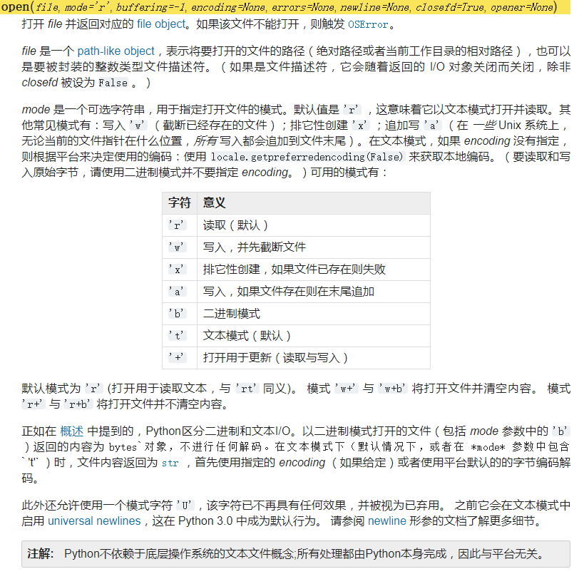
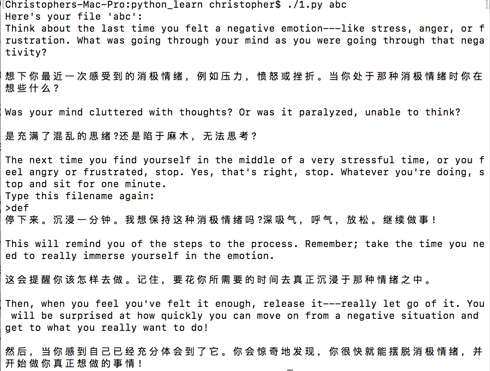
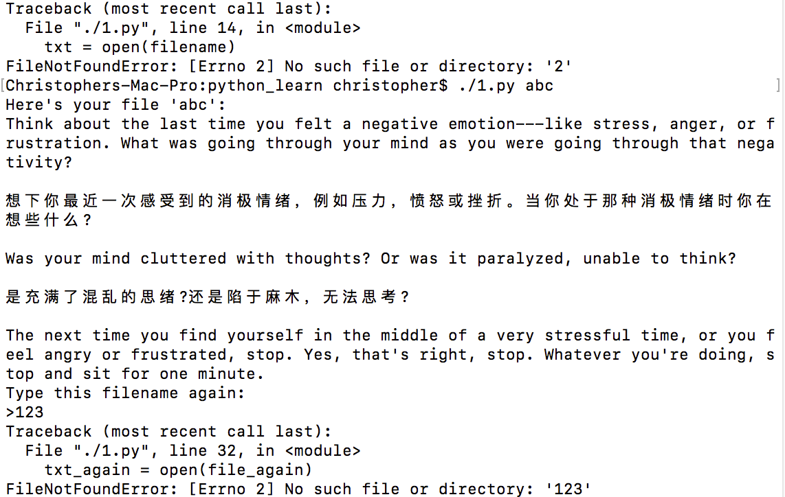
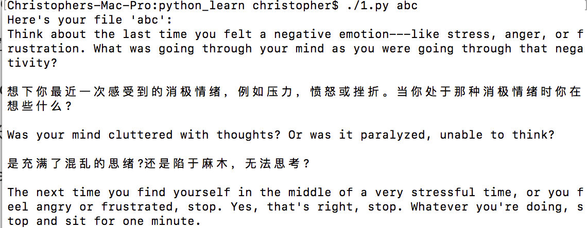
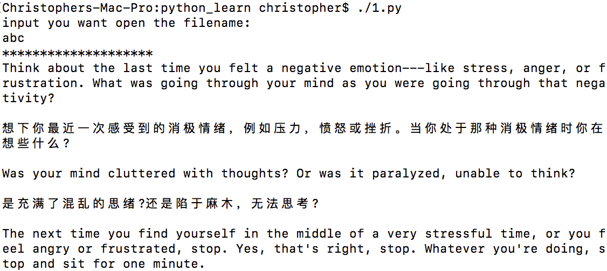
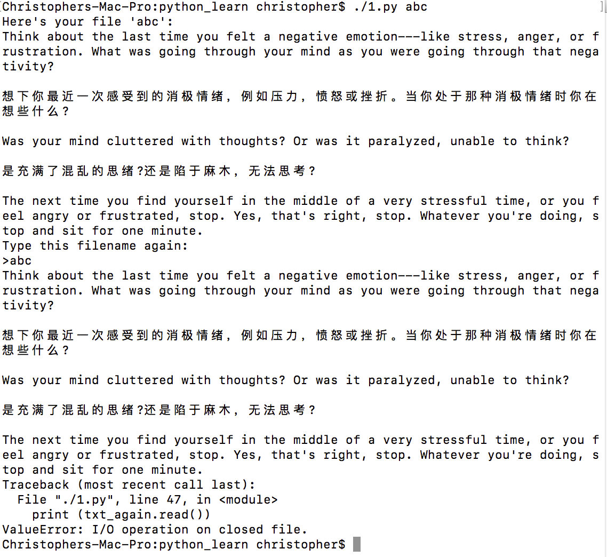

# Python基础15(ex15.py)

## 基本概念

本章使用open()函数来进行操作文件.

This chapter uses the open() function to manipulate files




## 实际练习

```
#!/usr/bin/env python3
#-*- coding:utf-8 -*-

from sys import argv
# 导入模块
# Import module

# 创建一个数组
# Create an array
myscript , filename = argv

# 创建变量等待赋值操作
# Create viriables waiting for assignment
txt = open(filename)

# 打印操作文件名称
# Print operation file name
print ("Here's your file %r:"%filename)

# 读取文件内的内容
# Read the contents for file 
print (txt.read())

print ("Type this filename again:")

# 接收用户输入的内容并赋值给变量
# Receive user input and assign values to variables 
file_again = input(">")

# 读取文档内容保存在变量中
# Read the document content and save it in a variable
txt_again = open(file_again)

# 输出读取到的内容
# Output read
print (txt_again.read())

```

实际效果：



## 分析与总结

在输入需要打开的文件时，请确保该文件存在于该路径中。

When entering a file that needs to be opened mask sure that the file exists in the path

否则会造成以下错误

otherwise it will cause the following error





## 附加练习

### 练习1删掉 10-15 行使用到 raw_input 的部分，再运行一遍脚本。

#### 简述答案：

实际上从第十行的代码可以看出，后续的操作只是新增了一次输入和读取的操作，所以这里只会从读取两次改变为一次。

In fact from the tenth line of code it can be seen that the subsequent operation only adds a new input and read operation so it will only change from reading twice to once


### 脚本

```
#!/usr/bin/env python3
#-*- coding:utf-8 -*-

from sys import argv
# 导入模块
# Import module

# 创建一个数组
# Create an array
myscript , filename = argv

# 创建变量等待赋值操作
# Create viriables waiting for assignment
txt = open(filename)

# 打印操作文件名称
# Print operation file name
print ("Here's your file %r:"%filename)

# 读取文件内的内容
# Read the contents fo file 
print (txt.read())

```

结果：



### 练习2只是用input 写这个脚本，想想那种得到文件名称的方法更好，以及为什么。

#### 简述答案：

在使用input来接收用户输入的参数时，会显得更加灵活，而不用在调用程序时候直接传入参数。

When using input to receive user input parameters it will be more fiexible instead of directly passing parameters when calling the program

### 脚本

```
#!/usr/bin/env python3
#-*- coding:utf-8 -*-

# 提示用户输入需要操作的文件
# Prompt the user for a file to be manipulated
filename = input('input you want open the filename:\n')

print ('*'*20)
# 将读取到的文件打开之后赋值给一个变量
# Open the read file and assign it to a variable
readfile = open(filename)

# 使用read()函数来进行输出
# Use read()function for output
print (readfile.read())
```

结果：




### 练习3再次运行 python 在命令行下使用 open 打开一个文件，这种 open 和 read 的方法也值得你一学。

#### 简述答案：

将以上操作在python命令行中执行

Do the above in the python command line

### 脚本

```
filename = open('/home/panda/Desktop/python3_learn/test')

print (filename.read())
```


### 练习4让你的脚本针对 txt and txt_again 变量执行一下 close() ，处理完文件后你需要将其关闭，这是很重要的一点

#### 简述答案：

在使用close()函数之后会关闭当前的文件的IO流，如果需要读取还需要重新打开一次.

After using the close() function the IO stream of the current file will be closed if you need to read it you need to reopen it 

### 脚本

```
#!/usr/bin/env python3
#-*- coding:utf-8 -*-

from sys import argv
# 导入模块
# Import module

# 创建一个数组
# Create an array
myscript , filename = argv

# 创建变量等待赋值操作
# Create viriables waiting for assignment
txt = open(filename)

# 打印操作文件名称
# Print operation file name
print ("Here's your file %r:"%filename)

# 读取文件内的内容
# Read the contents for file 
print (txt.read())

# 关闭IO流
# Close IO stream
txt.close()
print ("Type this filename again:")

# 接收用户输入的内容并赋值给变量
# Receive user input and assign values to variables 
file_again = input(">")

# 读取文档内容保存在变量中
# Read the document content and save it in a variable
txt_again = open(file_again)

# 输出读取到的内容
# Output read
print (txt_again.read())

# 关闭IO流
# Close IO stream
txt_again.close()

# 尝试重新读取
# Try to read again
print (txt_again.read())
```


结果：



关闭IO流之后无法再读取到当前文件.

After closing the IO stream the current file can no longer be read

## 附加笔记

在使用命令行来进行操作文件时，如果找不到你要操作的路径

可以先用os.path.expanduser(‘’) 来进行查询你当前需要操作的目录

When sing the command line to manipulate files if you cannot find the path you want to operate You can use os.path.expanduser(‘’)to query the directory you currently need to operate

在操作文件之后一定要关闭文件.

Be sure to close the file after working with it 