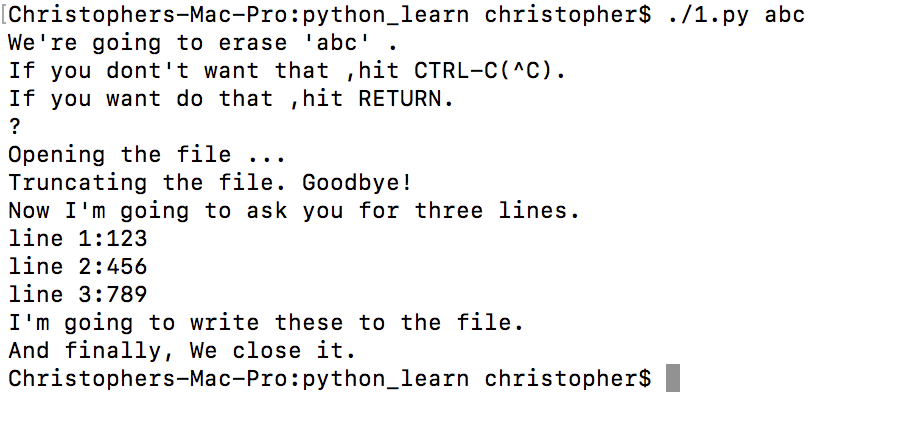
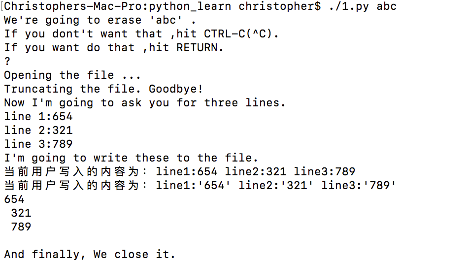
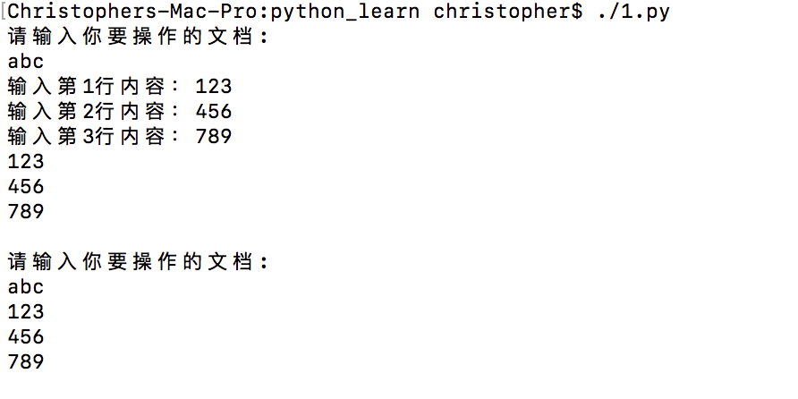

# Python基础16(ex16.py)

## 基本概念

使用open()函数中的write()方法，将用户输入的内容保存到文本中

在调用open()函数时，使用”w”会将当前操作的文本内的内容进行清空操作

Use the write() method in the open() function to savethe the user input into the text 

When calling the open() function use “w”to replace the content inside the currently operated text for a clear operation

## 实际练习

```
#!/usr/bin/env python3
#-*- coding:utf-8 -*-

from sys import argv 
# 导入模块
# Impoer module

myscript ,filename = argv
# 创建一个数组
# Create an array

print ("We're going to erase %r ."%filename)
print ("If you dont't want that ,hit CTRL-C(^C).")
print ("If you want do that ,hit RETURN.")
input ("?")
# 提示用户进行下一步操作
# Prompt user for next action


print ("Opening the file ...")
# 获取到当前需要操作的文件，并增加写入操作（"w"）
# Get the file that needs to be operated and increase the write operation("W")
target = open(filename,"w")
print ("Truncating the file. Goodbye!")

# 限定输入流大小
# Limit input stream size
target.truncate()

print ("Now I'm going to ask you for three lines.")

# 提示用户进行输入操作，并将用户输入的内容保存在变量中
# Prompt the user for an input operation and save teh user's input in a variable
line1 = input("line 1:")
line2 = input("line 2:")
line3 = input("line 3:")
print ("I'm going to write these to the file.")

# 将用户输入的内容进行写入到文档中
# Write user input into a document
target.write(line1)
target.write("\n")
target.write(line2)
target.write("\n")
target.write(line3)

print ("And finally, We close it.")
# 关闭当前IO流
# Close IO stream
target.close()
```

实际结果：



## 分析与总结：

使用open()函数中的“w”参数，会将文本内的内容进行清空

open()函数在调用时,默认使用“r”只读操作

Using the “w” parameter in the open()function will clear the contents of the text

The open()function uses ”r” read-only operation by default

## 附加练习

### 练习1写一个和上一个练习类似的脚本，使用 read 和 argv 读取你刚才新建的文件。

#### 答案简述：

创建文本并写入数据，使用read()来进行读取

create text and write data,read using read()

### 脚本

```
#!/usr/bin/env python3
#-*- coding:utf-8 -*-

# 提示用户输入需要操作的文件
# Prompt the user for a file to be manipulated
filename = input('input you want open the filename:\n')

print ('*'*20)
# 将读取到的文件打开之后赋值给一个变量
# Open the read file and assign it to a variable
readfile = open(filename)

# 使用read()函数来进行输出
# Use read()function for output
print (readfile.read())
```

效果：


### 练习2文件中重复的地方太多了。试着用一个 target.write() 将 line1, line2, line3 打印出来，你可以使用字符串、格式化字符、以及转义字符。

#### 简述答案：

使用字符串或格式化字符即可

### 脚本

```
#!/usr/bin/env python3
#-*- coding:utf-8 -*-


from sys import argv 
# 导入模块
# Impoer module

myscript ,filename = argv
# 创建一个数组
# Create an array

print ("We're going to erase %r ."%filename)
print ("If you dont't want that ,hit CTRL-C(^C).")
print ("If you want do that ,hit RETURN.")
input ("?")
# 提示用户进行下一步操作
# Prompt user for next action


print ("Opening the file ...")
# 获取到当前需要操作的文件，并增加写入操作（"w"）
# Get the file that needs to be operated and increase the write operation("W")
target = open(filename,"w+")
print ("Truncating the file. Goodbye!")

# 限定输入流大小
# Limit input stream size
target.truncate()

print ("Now I'm going to ask you for three lines.")

# 提示用户进行输入操作，并将用户输入的内容保存在变量中
# Prompt the user for an input operation and save teh user's input in a variable
line1 = input("line 1:")
line2 = input("line 2:")
line3 = input("line 3:")
print ("I'm going to write these to the file.")

print ("当前用户写入的内容为：line1:%s line2:%s line3:%s"%(line1,line2,line3))
print ("当前用户写入的内容为：line1:%r line2:%r line3:%r"%(line1,line2,line3))
print (line1,"\n",line2,'\n',line3,'\n')

# 将用户输入的内容进行写入到文档中
# Write user input into a document
#target.write(line1)
#target.write("\n")
#target.write(line2)
#target.write("\n")
#target.write(line3)

target.write(line1+'\n'+line2+'\n'+line3)

print ("And finally, We close it.")

# 关闭当前IO流
# Close IO stream
target.close()
```

结果：




### 练习3找出为什么我们需要给 open 多赋予一个 'w' 参数。提示： open 对于文件的写入操作态度是安全第一，所以你只有特别指定以后，它才会进行写入操作。

#### 简述答案：

open()函数在默认的情况下会调用‘-r’参数,并不会对文件进行写入操作

The open() function calls the ‘-r’ parameter by default and does not write to the file 

### 脚本

```
#!/usr/bin/env python3
#-*- coding:utf-8 -*-


# Receive instructions from users and manipulate files 
filename = open(input('请输入你要操作的文件名称:\n'))

# Read file content
print (filename.read())

# close the file
filename.close()

# Remind users what to do next
print ('接下来将文件进行写入操作')

# Receive instructions from users and manipulate files 
filename_again = open(input('请输入你要操作的文件名称'),'w')

# Receive data entered by the user and save it in a variable
line = input('请输入第一行：\n')
line1 = input('请输入第二行：\n')
line2 = input('请输入第三行：\n')

# Write data from variables into text
filename_again.write(line)
filename_again.write(line1)
filename_again.write(line2)

# Writing is complete and the file is closed
print ("写入完成,关闭文件")
filename_again.close()

```

### 练习4如果你用 'w' 模式打开文件，那么你是不是还要 target.truncate() 呢？阅读一下Python 的 open 函数的文档找找答案。

#### 简述答案:

如果使用’w’模式进行打开文件，则会清空原有文件内的内容，如果文件不存在则创建文件

truncate()函数是用来将文件内容清空后并使用ASCII码来进行占位，如果当前文本内的内容没有达到指定的字节数，则占位符会存在帮助占位，如果写入的数据超过了占位符的个数，则占位符会消失.

If you use ’w’ mode to open the file ,the contents of the original file will be emptied if the file does not exist it will be created The truncate() function is used to empty the file content and use ASCII code for placeholders if the content in the current text does not reach the specified number of bytes placeholders will help placeholders if the data is written if the number of placeholders is exceeded the placeholders will disappear 

默认的truncate()参数等于空，在清空文件的同时不会使用占位符，看起来效果则和’w‘一样

The default truncate() parameter is equal to empty no placeholders will be used while emptying the file it look like the effect is the same as ‘w’

### 脚本

```
#!/usr/bin/env python3
#-*- coding:utf-8 -*-


# 使用变量接收用户输入
# Receive user input using variables
filename = open(input('请输入你要操作的文档:\n'),'w+')

# 使用truncate()函数将文件内截断10个字节
# Use truncate() function to truncate 10 bytes in the file 
filename.truncate(10)

# 接收用户输入并保存在变量中
# Receive user input and save in variables 
a = input ('输入第1行内容：')
a1 = input ('输入第2行内容：')
a2 = input ('输入第3行内容：')


# 将变量中的值写入到文件中
# Write the value in a variable to a file 
filename.write(a+"\n")
filename.write(a1+"\n")
filename.write(a2+"\n")

# 将IO流指针指向文件开头，默认值为(0)
# Point the IO stream pointer to the beginning of the file the default value is (0)
filename.seek(0)

print (filename.read())
# 关闭IO流
# Close Io stream
filename.close()

# Receive user input using variables 
filename1 = open(input('请输入你要操作的文档:\n'))

# 读取文件中的内容
# Read the contents of a file 
print (filename1.read())

# 关闭IO流
# Close IO stream
filename1.close()
```

结果：



## 附加笔记

使用write()进行写入之后默认指针会移动到末尾，直接读取时会读取不到文件内容，所以需要将指针移动回文件头，使用seek()函数即可

seek()函数默认参数为0
 After writing using write() the default pointer will move to the end ,and the file content will not be read when reading directly so you need to move the pointer back to the file header 

seek() deault parameter is 0