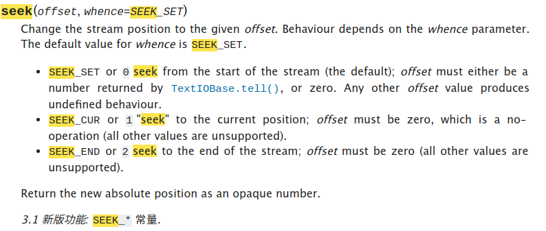
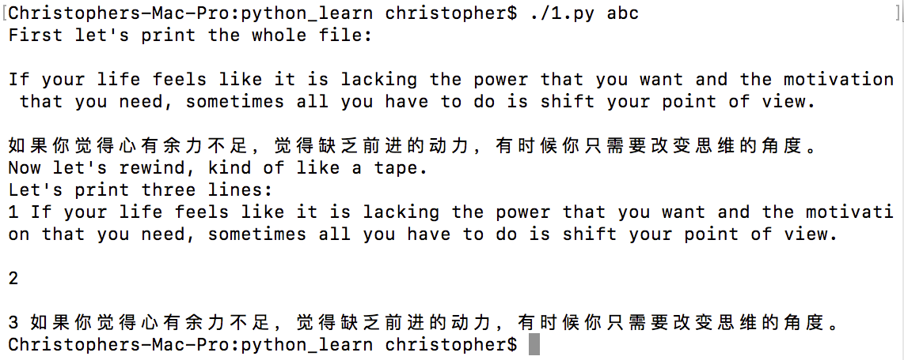
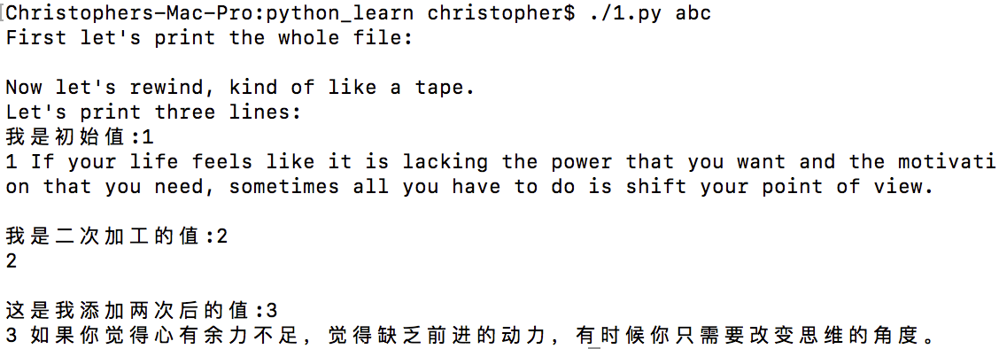
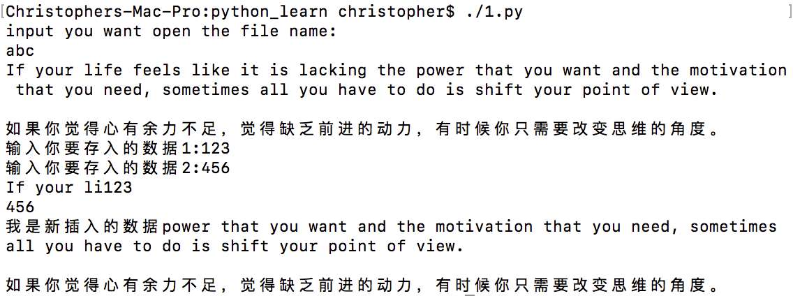

# Python基础20(ex20.py)

## 基本概念

本章使用IO流进行单行输出

This chapter uses IO streams for single line output 

使 用seek()来重新定位IO流指针的位置,参数为偏移量,默认偏移量为0

Use seek()to reposition the position of the IO stream pointer the parameter is the offset and the default offset is 0



## 实际练习

```
#!/usr/bin/env python3
#-*- coding:utf-8 -*-

# 导入sys中的argv模块
# Import argv module in sys
from sys import argv

# 创建一个数组
# Create an array
myscript , input_file = argv

# 定义一个函数
# Define a function
def print_all(f):
    print(f.read())

# 定义一个函数
# Define a function
def rewind(f):
	# 将指针移回文件开始位置,数字为几代表偏移几个字节量
    f.seek(0)

# 定义一个函数,设定两个参数
# Define a function
def print_a_line(line_count,f):
	# 打印出一个参数,并且输出一行文本内的内容
    print (line_count, f.readline())

# 创建一个新变量，接收控制台输入的参数(文件名)
current_file = open(input_file)

print("First let's print the whole file:\n")
# 调用函数,并传入变量.
# Call function and pass invariables
print_all(current_file)
# 调用函数进行输出文件内的内容 Call the function to output the contents of the file


print("Now let's rewind, kind of like a tape.")
# 将指针移动到该文件的文件头位置
# Move the pointer to the header position of the file 
rewind(current_file)

print("Let's print three lines:")

# 定义一个初始行号,并重复调用该方法来实现自增
# Define an initial line number and repeatedly call this method to achieve auto increment
current_line = 1
print_a_line(current_line,current_file)

# 在当前变量值的基础上再次加1 Add 1 to the current variable value
current_line = current_line + 1 
print_a_line(current_line,current_file)

# 在上一次变量值的基础上再次加1 Add 1 to the previous variable value
current_line = current_line + 1 
print_a_line(current_line,current_file)
```

实际结果:



## 分析与总结

readline()在打印时会将空行一起打印出来,打印完毕后会将指针移动到下一行.

Readline() prints blank lines together when printing and moves the pointer to the next line after printing

readline()会在当前行一直寻找’\n’ 直到找到为止

readline() will look for ‘\n’ on the current line until it finds it 

## 附加练习

### 练习1在每次调用函 数时，打印出 current_line 的值，跟踪一下它在 print_a_line 中是怎样变成 line_count 的

#### 简述答案:

添加输出语句,并打印当前值

Add output statement and print current value

### 脚本

```
#!/usr/bin/env python3
#-*- coding:utf-8 -*-

# 导入sys中的argv模块
# Import argv module in sys
from sys import argv

# 创建一个数组
# Create an array
myscript , input_file = argv

# 定义一个函数
# Define a function
def print_all(f):
    print(f.read())

# 定义一个函数
# Define a function
def rewind(f):
	# 将指针移回文件开始位置,数字为几代表偏移几个字节量
    f.seek(0)

# 定义一个函数,设定两个参数
# Define a function
def print_a_line(line_count,f):
	# 打印出一个参数,并且输出一行文本内的内容
    print (line_count, f.readline())

# 创建一个新变量，接收控制台输入的参数(文件名)
current_file = open(input_file)

print("First let's print the whole file:\n")
# 调用函数,并传入变量.
# Call function and pass invariables
#print_all(current_file)
# 调用函数进行输出文件内的内容 Call the function to output the contents of the file


print("Now let's rewind, kind of like a tape.")
# 将指针移动到该文件的文件头位置
# Move the pointer to the header position of the file 
rewind(current_file)

print("Let's print three lines:")

# 定义一个初始行号,并重复调用该方法来实现自增
# Define an initial line number and repeatedly call this method to achieve auto increment
current_line = 1
print (f'我是初始值:{current_line}')
print_a_line(current_line,current_file)

# 在当前变量值的基础上再次加1 Add 1 to the current variable value
current_line = current_line + 1 
print (f"我是二次加工的值:{current_line}")
print_a_line(current_line,current_file)

# 在上一次变量值的基础上再次加1 Add 1 to the previous variable value
current_line = current_line + 1 
print (f'这是我添加两次后的值:{current_line}')
print_a_line(current_line,current_file)
```

结果:




### 练习2上网研究一下 file 中的 seek 函数是做什么用的。试着运行 pydoc file 看看能不能学 到更多。 

#### 简述答案:

seek()方法用于移动指针到指定位置

seek() method is used to move the pointer to the specified position

### 脚本

```
#!/usr/bin/env python3
#-*- coding:utf-8 -*-

# 提示用户输入需要操作的文件名
# Prompt user for file name
filename = open(input('input you want open the file name:\n'),'r+')

# 读取文件内容
# Read file content
print(filename.read())

# 使用变量保存用户输入的数据
# Use variables to save user-entered data
str1 = input('输入你要存入的数据1:')
str2 = input('输入你要存入的数据2:')

# 数据偏移量20个字节
# Data offset 20 bytes
filename.seek(10)

# 写入之前用户输入的数据
# Write the data entered by the user before
filename.write(str1+'\n'+str2+'\n'+'我是新插入的数据')

# 将IO流指针移动到文件头
# Move the IO stream pointer to the file header
filename.seek(0,0)
# 读取文件内容
# Read file content
print(filename.read())
```

结果:



### 练习3研究一下 += 这个简写操作符的作用，写一个脚本，把这个操作符用在里边试一下。

#### 简述答案:

+=1 实际上是 a = a+1

### 脚本

```
#!/usr/bin/env python3
#-*- coding:utf-8 -*-

a = 1
print (a)
a = a+1
print(f"我是a的值{a}")

b = 1
print(b)
b += 1
print(f"我是b的值{b}")

```

结果:


## 附加笔记

无