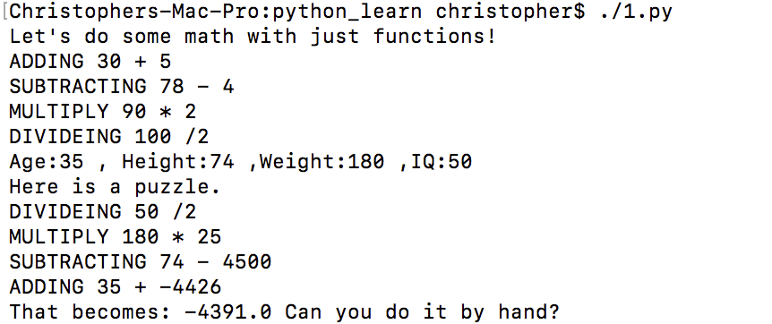
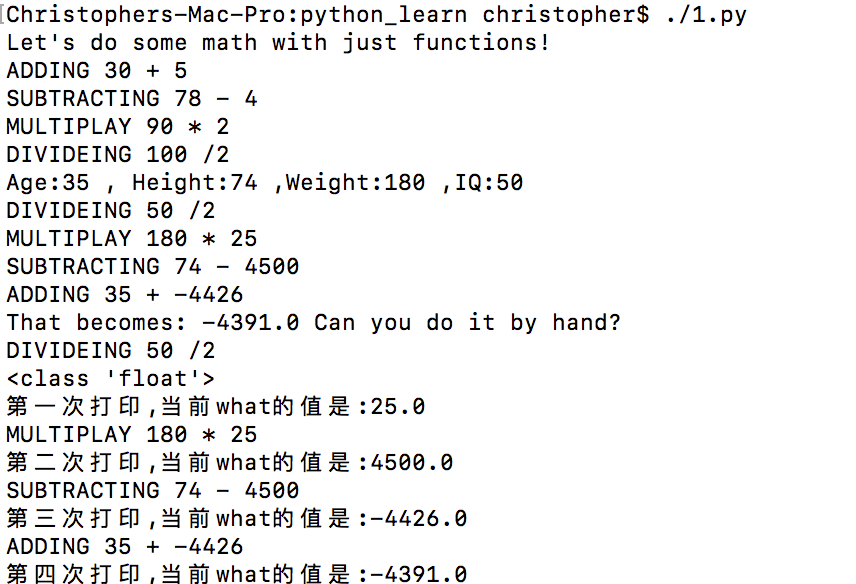

# Python基础21(ex21.py)

## 基本概念

函数需要先定义后调用,函数体中return语句的结果就是返回值,如果一个函数中没有return语句,其实它有一个隐含的return语句,返回值是None,类型也是NoneType

The function needs to be defined and then called The result of the return statement in the function body is the return value If there is no return statement in a function it actually has an implicit return statement The return value is None and the type is NoneType

return语句会将return后面的部分作为返回值输出,可以使用变量将返回值接收

The return statement will output the part after return as the return value You can use variables to receive the return value 

注:在执行了返回值后,当前函数会结束调用

Note: After the execution reaches the return value the current function will end the call 


## 实际练习

```
#!/usr/bin/env python3
#-*- coding:utf-8 -*-

# 定义一个函数
# Define a function 
def add(a,b):
    print("ADDING %d + %d "%(a,b))
    # 将结果返回,并且结束当前函数
    # Return the result and ends the current function
    return a + b
    
def subtract(a,b):
    print("SUBTRACTING %d - %d "%(a,b))
    return a - b

def multiply(a,b):
    print("MULTIPLY %d * %d" % (a,b))
    return a * b

def divide(a,b):
    print("DIVIDEING %d /%d " % (a,b))
    return a / b

print("Let's do some math with just functions!")

# 将返回值赋值给变量
# Assign the return value to a variable
age = add(30,5)
height = subtract(78,4)
weight = multiply(90,2)
iq = divide(100,2)

# 依次将返回的结果打印出来
# Print the returned results one by one 
print("Age:%d , Height:%d ,Weight:%d ,IQ:%d" % (age,height,weight,iq))

# A puzzle for the extra credit, type it in anyway.
print("Here is a puzzle.")
# 使用变量来接收返回值,将括号内的值依次传入add方法内进行计算并返回结果.
# Use variables to receive the return value pass the values in parentheses into the add method in order to calculate and return the result
# 运算原则,从最里面的括号开始进行运算
# Operation principle starting from the innermost parentheses
what = add (age,subtract(height,multiply(weight,divide(iq,2))))

print("That becomes:",what,"Can you do it by hand?")
```

实际结果:



## 分析与总结

函数内可以有多个返回值,但是只要执行了return操作,则之后的代码都不会被执行

There can be multiple return values within the function but as long as the return operation is performed the subsequent code will not be executed 


## 附加练习

### 练习1如果你不是很确定 return 的功能，试着自己写几个函数出来，让它们返回一些值。你可以将 任何可以放在 = 右边的东西作为一个函数的返回值。

#### 简述答案:

返回值可以返回一个具体的值,也可以返回一个具体的等式

The return value can return a specific value or a specific equation 

### 脚本

```
#!/usr/bin/env python3
#-*- coding:utf-8 -*-

def add(a,b):
    print("ADDING %d + %d " % (a,b))
    return a + b
    
def add1(a,b):
    print("adding %d + %d " % (a,b))
    sum1 = a + b
    return sum1

age = add(30,5)
egg = add1(30,5)

print("Age:%d " % age)
print("egg:%d " % egg)
```

结果:


### 练习2这个脚本的结尾是一个迷题。我将一个函数的返回值用作了另外一个函数的参数。我将它们链接 到了一起，就跟写数学等式一样。这样可能有些难读，不过运行一下你就知道结果了。接下来， 你需要试试看能不能用正常的方法实现和这个表达式一样的功能。

#### 简述答案:

从内层代码到外层代码进行解开,从最内层的括号开始进行计算,当前拿到返回值后再进行下一次运算

Unpack from the inner code to the outer code calculate from the innermost brackets and them perform the next operation after getting the return value

### 代码

```
#!/usr/bin/env python3
#-*- coding:utf-8 -*-

# 定义一个函数
# Define a function 
def add(a,b):
    print("ADDING %d + %d " % (a,b))
    # 将结果返回,并且结束当前函数
    # Return the result and ends the current function
    return a + b
    
def subtract(a,b):
    print("SUBTRACTING %d - %d " % (a,b))
    return a - b

def multiply(a,b):
    print("MULTIPLAY %d * %d" % (a,b))
    return a * b

def divide(a,b):
    print("DIVIDEING %d /%d " % (a,b))
    return a / b

print("Let's do some math with just functions!")

# 将返回值赋值给变量
# Assign the return value to a variable
age = add(30,5)
height = subtract(78,4)
weight = multiply(90,2)
iq = divide(100,2)

# 依次将返回的结果打印出来
# Print the returned results one by one 
print("Age:%d , Height:%d ,Weight:%d ,IQ:%d" % (age,height,weight,iq))

what = add (age,subtract(height,multiply(weight,divide(iq,2))))
print("That becomes:",what,"Can you do it by hand?")

what = divide(iq,2)
print(type(what))
print (f"第一次打印,当前what的值是:{what}")
what = multiply(weight,what)
print (f"第二次打印,当前what的值是:{what}")
what = subtract(height,what)
print (f"第三次打印,当前what的值是:{what}")
what = add (age,what)
print (f"第四次打印,当前what的值是:{what}")
```

结果:




## 附加笔记

返回值可以是任意类型,也可以在返回时进行强制转换,但是只限定在相同的数据类型

The return value can be of any type ,and can also be cast on return but it is limited to the same data type 