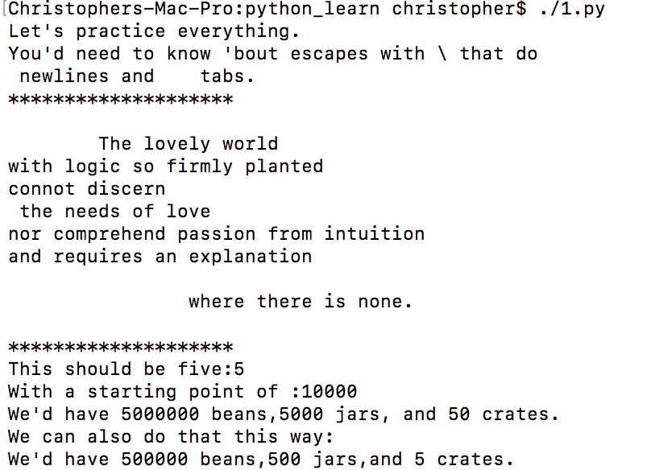
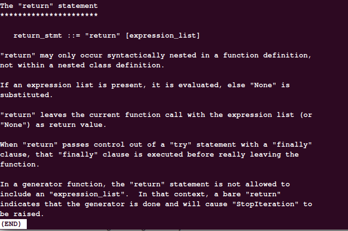

# Python基础24(ex24.py)

## 基本概念:

无

## 实际练习

```
#!/usr/bin/env python3
#-*- coding:utf-8 -*-


print ("Let's practice everything.")
print ("You\'d need to know \'bout escapes with \\ that do \n newlines and \t tabs.")

# 定义一个变量
# Define a variables
poem = '''
\tThe lovely world
with logic so firmly planted
connot discern \n the needs of love
nor comprehend passion from intuition 
and requires an explanation
\n\t\twhere there is none.
'''
 
print ("*"*20)
print (poem)
print ("*"*20)

five = 10 - 2 + 3 - 6
print ("This should be five:%d " % five)

# 定义一个函数,进行一些计算
def secret_formula(started):
	jelly_beans = started * 500
	jars = jelly_beans / 1000
	crates = jars /100
	# 返回三个计算后的值
	# Returns the three calculated valurs
	return jelly_beans,jars,crates

# 定义一个变量
# Define a variable
start_point = 10000
# 传入一个参数在函数中进行计算,同时将返回值接收
# The first parameter is calculated in the function and the return value is received
beans ,jars ,crates = secret_formula(start_point)
# 以下为测试代码 The following is the test code
'''
print(f'我是beans:{beans}')
print(f'我是jars:{jars}')
print(f'我是crates:{crates}')
'''
# 打印当前变量的值 Print the value of the current variable
print ("With a starting point of :%d" % start_point) 
# 打印接收到的返回值 Print the received return value
print ("We'd have %d beans,%d jars, and %d crates." % (beans,jars,crates)) 

start_point = start_point / 10

print ("We can also do that this way:")
# 传入一个参数,然后直接将返回值打印在语句中
# Pass in a parameter and print the return value directly in the statement
print ("We'd have %d beans,%d jars,and %d crates." % secret_formula(start_point)) 
```

实际结果:




## 分析与总结

返回值可以有多个,并且返回值可以直接使用格式化字符串来进行使用(%)

There can be multiple return values and the return value can be directly used by the format string(%)

有多个返回值时，会将所有的返回值，打包成一个元组进行回传

When there are multiple return values all return values are packed into a tuple for return 



## 附加练习

无

## 附加笔记

无