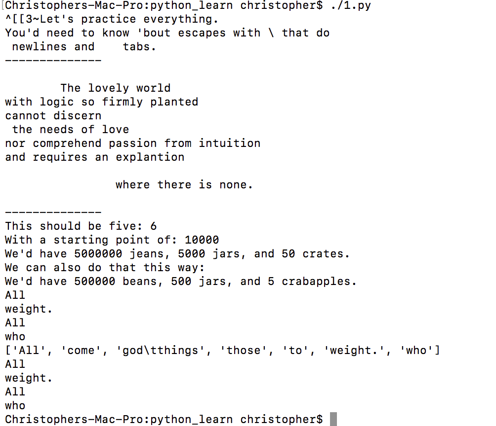

# Python基础26(ex26.py)

## 考试

### 需求：修正现有程序

### 原有代码：

```
def break_words(stuff):
    """This function will break up words for us."""
    words = stuff.split(' ')
    return words

def sort_words(words):
    """Sorts the words."""
    return sorted(words)

def print_first_word(words)
    """Prints the first word after popping it off."""
    word = words.poop(0)
    print word

def print_last_word(words):
    """Prints the last word after popping it off."""
    word = words.pop(-1
    print word

def sort_sentence(sentence):
    """Takes in a full sentence and returns the sorted words."""
    words = break_words(sentence)
    return sort_words(words)

def print_first_and_last(sentence):
    """Prints the first and last words of the sentence."""
    words = break_words(sentence)
    print_first_word(words)
    print_last_word(words)

def print_first_and_last_sorted(sentence):
    """Sorts the words then prints the first and last one."""
    words = sort_sentence(sentence)
    print_first_word(words)
    print_last_word(words)


print "Let's practice everything."
print 'You\'d need to know \'bout escapes with \\ that do \n newlines and \t tabs.'

poem = """
\tThe lovely world
with logic so firmly planted
cannot discern \n the needs of love
nor comprehend passion from intuition
and requires an explantion
\n\t\twhere there is none.
"""


print "--------------"
print poem
print "--------------"

five = 10 - 2 + 3 - 5
print "This should be five: %s" % five

def secret_formula(started):
    jelly_beans = started * 500
    jars = jelly_beans \ 1000
    crates = jars / 100
    return jelly_beans, jars, crates


start_point = 10000
beans, jars, crates == secret_formula(start-point)

print "With a starting point of: %d" % start_point
print "We'd have %d jeans, %d jars, and %d crates." % (beans, jars, crates)

start_point = start_point / 10

print "We can also do that this way:"
print "We'd have %d beans, %d jars, and %d crabapples." % secret_formula(start_pont


sentence = "All god\tthings come to those who weight."

words = ex25.break_words(sentence)
sorted_words = ex25.sort_words(words)

print_first_word(words)
print_last_word(words)
.print_first_word(sorted_words)
print_last_word(sorted_words)
sorted_words = ex25.sort_sentence(sentence)
prin sorted_words

print_irst_and_last(sentence)

   print_first_a_last_sorted(senence)
```

开始修正代码：

def print_first_word(words)

此处少了后方的冒号标示符

The colon identifier is missing here 

小括号没有闭合

The parentheses are not closed

 

除数的斜杠写

 

在提示代码处少了小括号，第76行

 

在第86行处多写了一个小数点

 

第89行出现单词拼写错误

 

第93行出现缩进错误

 
 

### 以下为运行时错误：

….

### 修正后代码：

```
#!/usr/bin/env python3
#-*- coding:utf-8 -*-

def break_words(stuff):
    """This function will break up words for us."""
    words = stuff.split(' ')
    return words

def sort_words(words):
    """Sorts the words."""
    return sorted(words)

def print_first_word(words):
    """Prints the first word after popping it off."""
    word = words.pop(0)
    print (word)

def print_last_word(words):
    """Prints the last word after popping it off."""
    word = words.pop(-1)
    print (word)

def sort_sentence(sentence):
    """Takes in a full sentence and returns the sorted words."""
    words = break_words(sentence)
    return sort_words(words)

def print_first_and_last(sentence):
    """Prints the first and last words of the sentence."""
    words = break_words(sentence)
    print_first_word(words)
    print_last_word(words)

def print_first_and_last_sorted(sentence):
    """Sorts the words then prints the first and last one."""
    words = sort_sentence(sentence)
    print_first_word(words)
    print_last_word(words)


print ("Let's practice everything.")
print ('You\'d need to know \'bout escapes with \\ that do \n newlines and \t tabs.')

poem = """
\tThe lovely world
with logic so firmly planted
cannot discern \n the needs of love
nor comprehend passion from intuition
and requires an explantion
\n\t\twhere there is none.
"""


print ("--------------")
print (poem)
print ("--------------")

five = 10 - 2 + 3 - 5
print ("This should be five: %s" % five)

def secret_formula(started):
    jelly_beans = started * 500
    jars = jelly_beans / 1000
    crates = jars / 100
    return jelly_beans, jars, crates


start_point = 10000
beans , jars, crates = secret_formula(start_point)

print ("With a starting point of: %d" % start_point)
print ("We'd have %d jeans, %d jars, and %d crates." % (beans, jars, crates))

start_point = start_point / 10

print ("We can also do that this way:")
print ("We'd have %d beans, %d jars, and %d crabapples." % secret_formula(start_point))


sentence = "All god\tthings come to those who weight."

words = break_words(sentence)
sorted_words = sort_words(words)

print_first_word(words)
print_last_word(words)
print_first_word(sorted_words)
print_last_word(sorted_words)
sorted_words = sort_sentence(sentence)
print (sorted_words)

print_first_and_last(sentence)

print_first_and_last_sorted(sentence)
```


#### 修正后结果：



### 总结：

括号，拼写，缩进，养成良好的习惯

Braces , spelling ,indentation ,good habits.

