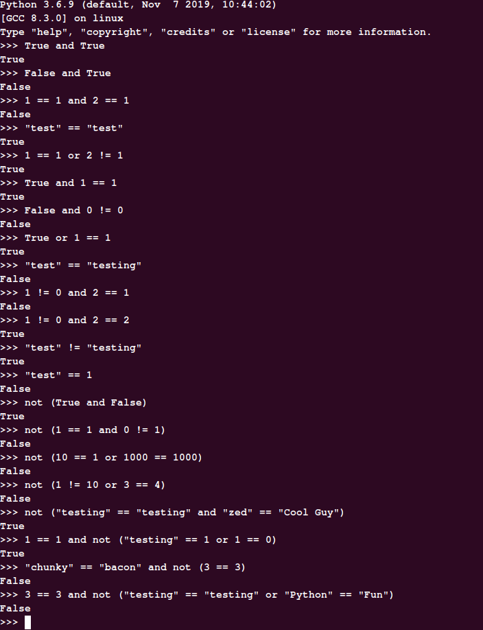

# Python基础28(ex28.py)

## 基本概念

基本流程：

找到相等判断的部分（== or !=）将其改写为最终值（True 或 False）

Find the equal judgment part (== or !=) And rewrite it to the final value (True or False)

找到括号里的and/or 先计算出来当前值

Find the and /or in parentheses and calculate the current value

找到每一个not，计算反过来的值

Find each not and calculate the inverse value

找到剩下的and/or，计算出他们的值

Find the remaining and /or and calculate their values

## 实际练习

```
#!/usr/bin/env python3
#-*- coding:utf-8 -*-


True and True 
# 返回值为true
# Return value is true
False and True 
# 返回值为false
# Return value is False
1 == 1 and 2 == 1 
# 返回值为false
# Return value is False
"test" == "test" 
# 返回值为true
# Return value is True
1 == 1 or 2 != 1 
# 返回值为true
# Return value is True
True and 1 == 1 
# 返回值为true
# Return value is true
False and 0 != 0 
# 返回值为false
# Return value is False
True or 1 == 1 
# 返回值为true
# Return value is true
"test" == "testing" 
# 返回值为false
# Return value is false
1 != 0 and 2 == 1 
# 返回值为False
# Return value is False
"test" != "testing" 
# 返回值为true
# Return value is true
"test" == 1 
# 返回值为false
# Return value is false
not (True and False) 
# 返回true
# Return value is true
not (1 == 1 and 0 != 1) 
# 返回false
# Return value is False
not (10 == 1 or 1000 == 1000) 
# 返回false
# Return value is False
not (1 != 10 or 3 == 4) 
# 返回false
# Return value is False
not ("testing" == "testing" and "Zed" =="Cool Guy") 
# 返回true
# Return value is true
1 == 1 and not ("testing" == 1 or 1 == 0) 
# 返回true
# Return value is true
"chunky" == "bacon" and not (3 == 4 or 3 == 3) 
# 返回false
# Return value is false
3 == 3 and not ("testing" == "testing" or "Python" == "Fun") 
# 返回false
# Return value is False
```

实际效果：



## 分析与总结

在实际运算过程中会发现，当not和and以及or在一起进行运算时，优先级为not>and>or

In the actual calculation process ,it will be found that when not and and and or are operated together the priority is not>and> or


## 附加练习

### 练习1Python 里还有很多和 != 、 == 类似的操作符. 试着尽可能多地列出 Python 中的等价运算符。 例如 < 或者 <= 

#### 简述答案：

== 两边数据计算结果相等则为真

\>= 左边的大于右边的为真

<= 左边的小于右边的为真

!= 两边数据计算结果不相等则为真

### 脚本

```
#!/usr/bin/env python3
#-*- coding:utf-8 -*-


a = 10
b = 20

print(f"我是计算a==b:{a==b}")
print(f"我是计算a>=b:{a>=b}")
print(f"我是计算a<=b:{a<=b}")
print(f"我是计算a!=b:{a!=b}")
```

结果：


## 附加笔记

短路逻辑： Short-circuit logic:

and中的运算，找到第一个false，将会直接返回false，全部为真才为真

The operation in and if the first false is found it will return false directly all of which are true

or中的运算，有一个为真，则返回真，若全部为假则为假

The operation in or if one is true it return true if all are false it is false

!= 计算完成之后直接取反，为真的取反则为假。

!= Invert directly after the calculation is complete if true the negation is false