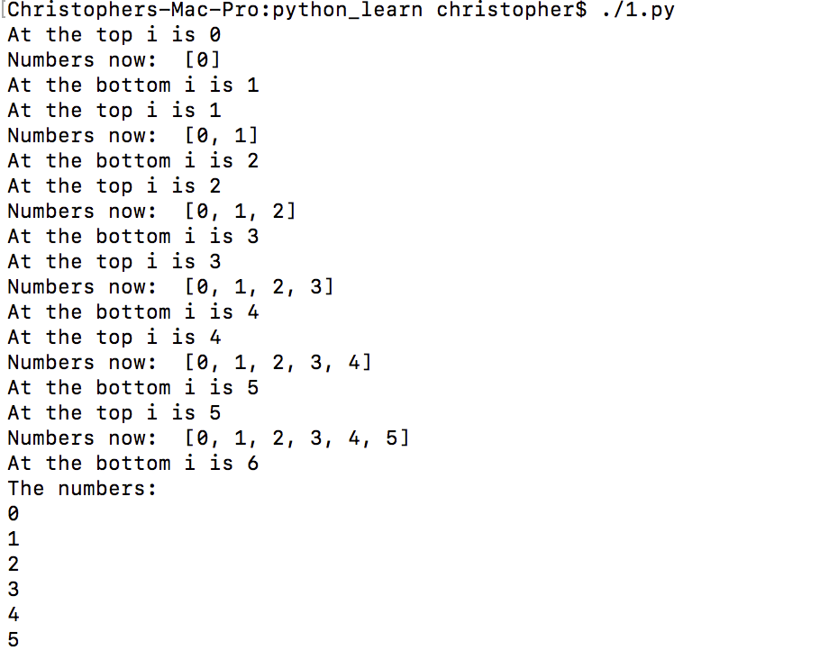
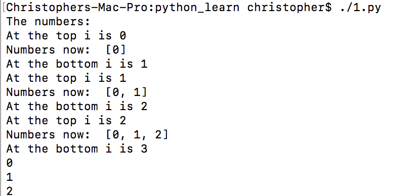
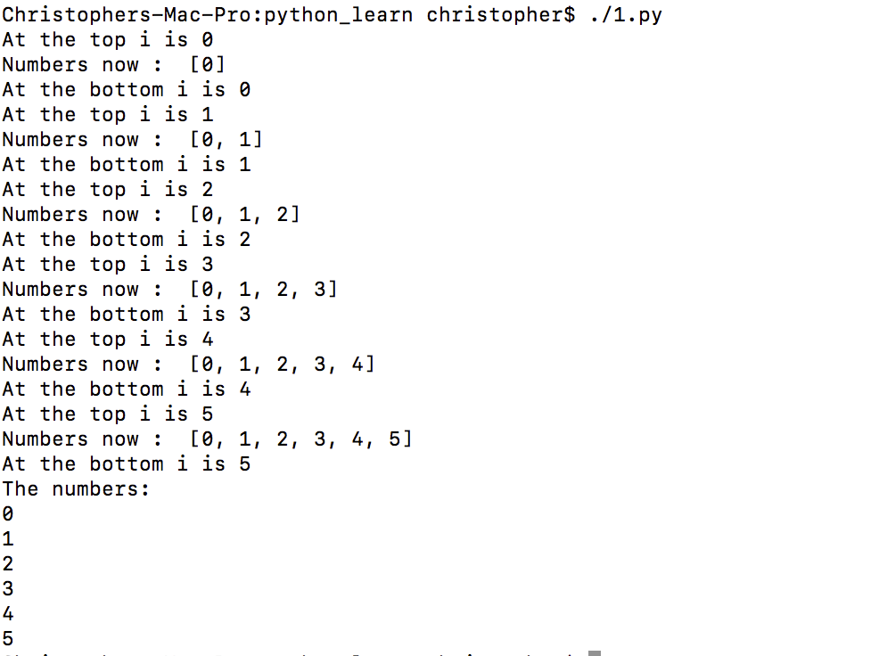

# Python基础33(ex33.py)

## 基本概念

while循环在进行执行循环体时,需先判断条件是否为true,否则退出循环体

When the while loop executes the body of the loop ,it must first determine whether the condition is true otherwise it exits the loop body

while循环与for循环不同的地方在于,for循环是重复执行单一代码块

The difference between a while loop and a for loop is that a for loop is a single block of code that is executed repeatedly

在while循环内可以嵌套for循环

You can nest for loops inside a while loop 

## 实际练习

```
#!/usr/bin/env python3
#-*- coding:utf-8 -*-

# 定义一个变量，设置初始值
# Define a variable and set the initial value
i = 0

# 创建一个空列表
# Create an empty list
numbers = []

# while循环开始
# while loop starts
while i < 6 :
    print ("At the top i is %d" % i)
    # 使用append函数将每次循环得到的值追加写入到创建的空列表中
    # Use the append function to append the value obtained by each loop to the created empty list
    numbers.append(i)

    # 变量自增1
    # Variable autoincrement 1
    i = i + 1

    # 打印出当前列表中的元素
    # Print out the elements in the current list
    print ("Numbers now: ",numbers)

    # 打印当前i变量的值
    # Print the value of the current i variable
    print ("At the bottom i is %d " % i)

print ("The numbers:")

# 使用for循环将列表中的值全部输出
# Use a for loop to output all the values in the list
for num in numbers:
    print (num)
```

实际结果:



## 分析与总结

在使用过程中尽量少用while循环,大部分时候使用for循环是更好的选择

Minimize the use of while loops during use most of the time using a for loop is a better choice

使用过程中应该尽量避免死循环

Try to avoid endless loops during use

## 附加练习

### 练习1将这个while循环改成一个函数，将测试条件(i < 6)中的 6 换成一个变量。

#### 简述答案

定义一个函数,设置一个参数,并将该参数传入while循环判断中

Define a function set a parameter and pass the parameter into the while loop judgment

### 脚本

```
#!/usr/bin/env python3
#-*- coding:utf-8 -*-

# 创建一个空列表
# Create an empty list
numbers = []

# while循环开始
# while loop starts
def my_append(number) :
    # 在函数内定义一个初始变量
    # Define an initial variable inside the function
    i = 0
    while i < number :
        print ("At the top i is %d" % i)
        # 使用append函数将每次循环得到的值追加写入到创建的空列表中
        # Use the append function to append the value obtained by each loop to the created empty list
        numbers.append(i)

        # 变量自增1
        # Variable autoincrement 1
        i = i + 1

        # 打印出当前列表中的元素
        # Print out the elements in the current list
        print ("Numbers now: ",numbers)

        # 打印当前i变量的值
        # Print the value of the current i variable
        print ("At the bottom i is %d " % i)

print ("The numbers:")

# 调用函数，并传入一个参数
# Call the function and pass in a parameter
my_append(3)

# 使用for循环将列表中的值全部输出
# Use a for loop to output all the values in the list
for num in numbers:
    print (num)
```

结果:



### 练习2接下来使用 for-loop 和 range 把这个脚本再写一遍。你还需要中间的加值操作吗？如果你不去掉它，会有什么样的结果？

#### 简述答案:

不需要在代码中使用自增来结束当前循环,因为在for循环中第一个参数的取值是取的后面参数中的值

There is no need to use autoincrement in the code to end the current loop because the value of the first parameter in the for loop is the value in the subsequent parameters

如果不去掉i=i+1也不会有什么影响,因为这是两个不同的变量

It won’t matter if i = i+1 is not removed because these are two different variables

### 脚本

```
#!/usr/bin/env python3
#-*- coding:utf-8 -*-


def my_number() :
    # 创建一个空列表
    # Create an empty list
    numbers = []
    for i in range(0,6) :
        print ("At the top i is %d" % i)
        # 将每次获得的值通过append函数追加写入numbers列表中
        # Append the value obtained each time to the numbers list through the append funtion 
        numbers.append(i)

        print ("Numbers now : ",numbers)
        print ("At the bottom i is %d" % i)

    # 将numbers的函数打印依次打印出来
    # Print the functions of numbers in turn
    print ("The numbers:")	
    for num in numbers:
        print (num)

# 调用函数
# call the function
my_number()
```

结果:



## 附加笔记

在for循环和while循环中可以使用break和continue来进行终止或跳出当前循环

Break and continue can be used in for loops and while loops to terminate or exit the current loop

Break语句用来终止循环语句,即循环条件没有False条件或者序列还没被完全递归完,也会停止执行循环语句

The Break statement is used to terminate the loop statement that is if the loop condition dos not have a false condition or the sequence has not been completely recursive the loop statement will also stop executing

Continue语句用来跳过当前循环的剩余语句,然后进行下一轮循环

The Continue statement is used to skip the remaining statements of the current loop and then proceed to the next cycle